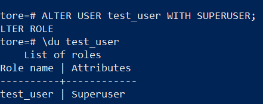
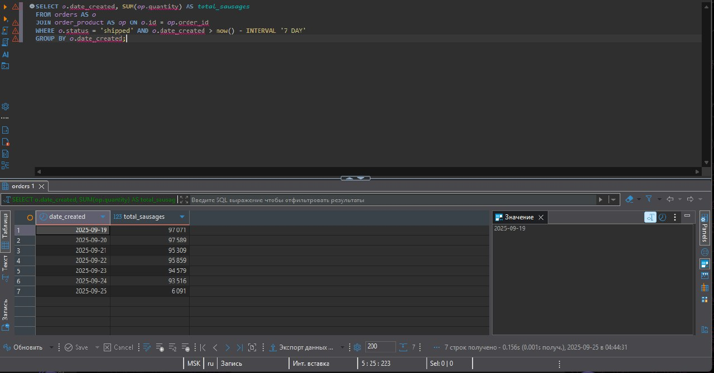
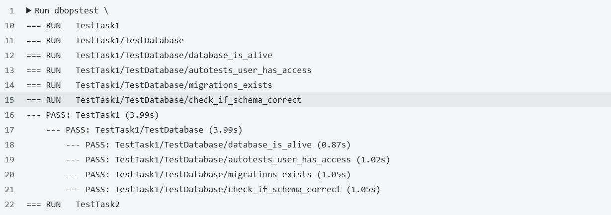
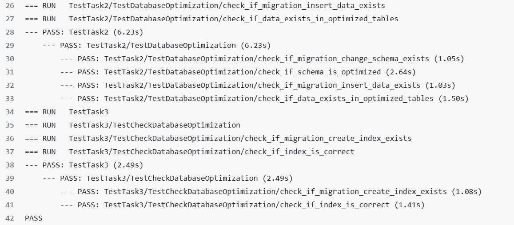

# Проект DBOps

### Создание БД store
```sql
CREATE DATABASE store;
```
### Установка и запуск Docker-compose
```sql
apt install docker-compose
docker-compose up -d
```
### Загрузка данных
``` sql
sudo nano insert-data.sh
sudo bash insert-data.sh
```

### Просмотр структуры
``` sql
psql "host=localhost port=5432 dbname=store_default user=user"
\dt
\d
```

### Создание нового пользователя и выдача прав
```sql
CREATE USER test_user WITH PASSWORD 'test_password'
GRANT ALL PRIVILEGES ON DATABASE store TO test_user
ALTER USER test_user WITH SUPERUSER
```
Скриншот проверки выданных прав:


### Добавлены секреты в хранилище GitHub:
```properties
DB_HOST: <IP_адрес>
DB_PORT: 5432
DB_NAME: store
DB_USER: test_user
DB_PASSWORD: test_password
```
### SQL-запрос, который показывает, какое количество сосисок было продано за предыдущую неделю
```sql
SELECT o.date_created, SUM(op.quantity) AS total_sausages
FROM orders AS o
JOIN order_product AS op ON o.id = op.order_id
WHERE o.status = 'shipped' AND o.date_created > now() - INTERVAL '7 DAY'
GROUP BY o.date_created;
```
Скриншот выполненного запроса:


По результатам проведённых работ в проект dbops добавлены миграции:
1. Шаг для очистки и выполнения миграций
2. Запрос V001__create_tables.sql — создание таблиц.
2. Запрос V002__change_schema.sql — нормализация схемы.
3. Запрос V003__insert_data.sql — заполнение таблиц данными.
4. Запрос V004__create_index.sql — создание индексов для отчётов.
Все автотесты выполнены успешно:




